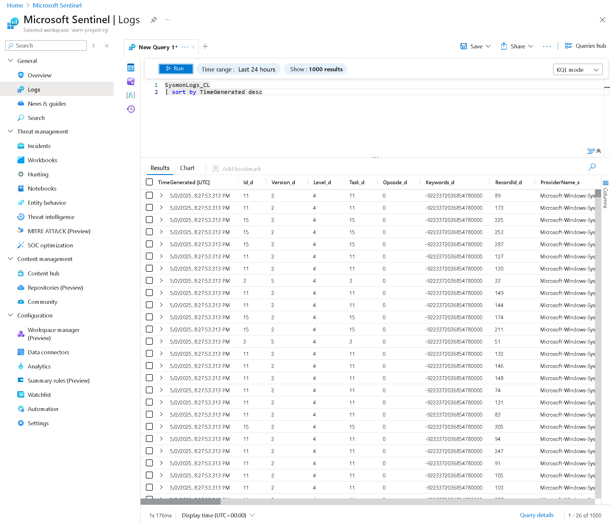
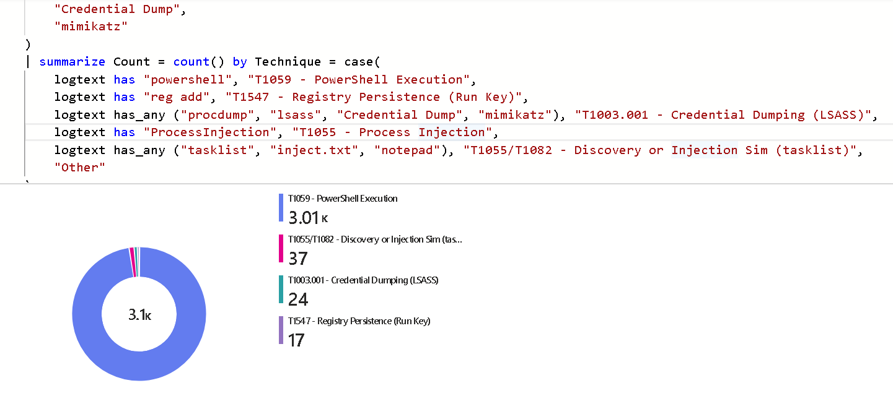

## 🔐 Cloud-Native SIEM with Microsoft Sentinel and AWS

This project demonstrates how to build a low-cost, cloud-native SIEM pipeline using **Microsoft Sentinel** and a **Windows EC2 instance** on AWS. Logs are collected via Sysmon, optionally enriched with simulated attack data (Atomic Red Team), and sent to Sentinel using a custom Python script and the Azure Monitor HTTP Data Collector API.


### 🧩 Architecture Overview

```
+----------------------+
|  Microsoft Sentinel  |
|  (Log Analytics API) |
+----------^-----------+
           |
           |
   +-------+--------+
   |  Python Script |
   | (Log Forwarder)|
   +-------^--------+
           |
+---------------------------+
|  Windows EC2 (AWS Free)   |
|  - Sysmon + Attack Sim    |
+---------------------------+
```

### 🚀 Key Features
- ✅ Uses AWS EC2 (Free Tier) as the log source
- ✅ Collects Windows Event Logs via Sysmon
- ✅ Optionally simulates adversary techniques using Atomic Red Team
- ✅ Forwards logs to Microsoft Sentinel using a Python script
- ✅ Validates ingestion using KQL queries mapped to MITRE ATT&CK

## 🛠️ Setup Instructions

For a full step-by-step guide on deploying this SIEM project using AWS and Microsoft Sentinel:

➡️ [Read the full setup guide here](./docs/setup.md)


### 🔎 Query Logs in Sentinel (KQL)
```
SysmonLogs_CL
| sort by TimeGenerated desc

SysmonLogs_CL
| where CommandLine_s has "powershell"
```

<p align="center">
  
</p>

<p align="center">
  
</p>


### 📈 Project Benefits
| Skill                    | Demonstrated                        |
| ------------------------ | ----------------------------------- |
| AWS Infrastructure       | ✅ EC2 provisioning, security groups |
| Windows System Logging   | ✅ Sysmon setup, event log analysis  |
| Threat Simulation        | ✅ Atomic Red Team (T1059 example)   |
| Cloud SIEM Integration   | ✅ Microsoft Sentinel, API ingestion |
| Python Automation        | ✅ HTTP forwarding script            |
| Threat Detection Queries | ✅ KQL and MITRE ATT\&CK alignment   |


### 💰 Cost Estimate 
| Resource               | Cost Estimate                    |
| ---------------------- | -------------------------------- |
| EC2 Windows (t2.micro) | Free (750 hrs/month)             |
| Microsoft Sentinel     | Free (up to 10 GB/day ingestion) |
- 💡 Tip: Stop EC2 when not in use to avoid unexpected charges.

### 🛡️ Security Best Practices
- Use .gitignore to exclude:
    - .pem keys
    - *.json logs
    - *.pyc and other temp files
- Do not commit your Sentinel workspace keys
- Run git secrets --scan-history before pushing to GitHub

### 📂 Repo Structure
```
├── logs/
│   └── sysmon_logs.json
├── scripts/
│   └── send_logs_to_sentinel.py
├── docs/
│   └── setup.md
├── .gitignore
└── README.md
```