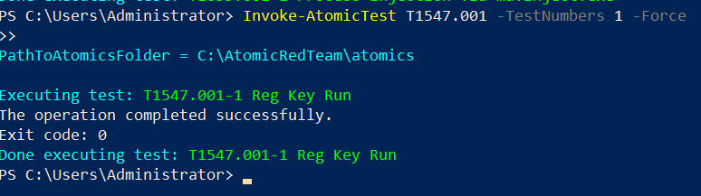
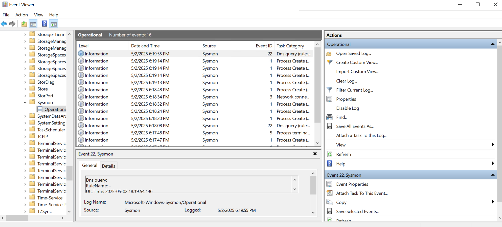
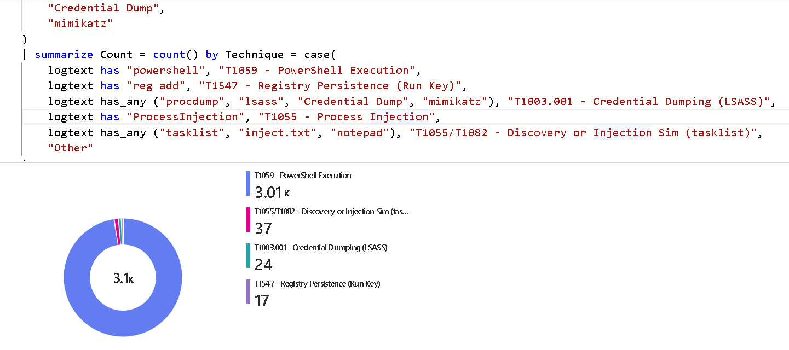

## 🛠️ Project Setup Guide: AWS + Microsoft Sentinel SIEM

This document provides step-by-step instructions for setting up a lightweight security monitoring pipeline using a Windows EC2 instance and Microsoft Sentinel.


### 🧩 Overview

This project collects Windows logs using Sysmon, simulates adversary behavior with Atomic Red Team, and forwards logs to Microsoft Sentinel using a custom Python script.


### 🔹 Step 1: Launch a Windows EC2 Instance

### ✅ Create EC2 Instance
- Go to [AWS Console](https://console.aws.amazon.com/)
- Choose **Windows Server 2019 Base** (or newer)
- Use **t2.micro** (Free Tier)
- Enable **RDP (port 3389)** in the security group
- Download and save your `.pem` key pair

### ✅ Connect to EC2
- Use RDP with the EC2 public IP
- Decrypt password using your `.pem` file
- Log in as `Administrator`


### 🔹 Step 2: Install Sysmon

### ✅ Download and Install Sysmon
- Download Sysmon from: https://docs.microsoft.com/en-us/sysinternals/downloads/sysmon
- Also download [SwiftOnSecurity's config](https://github.com/SwiftOnSecurity/sysmon-config)

### ✅ Install with Config
- Run Powershell as Administrator 
```
sysmon64.exe -accepteula -i sysmonconfig.xml
```

<p align="center"> 
  
</p>


### 🔹 Step 3: Simulate Attacks (Atomic Red Team + Safe Alternatives)

### ✅ Install Atomic Red Team Module
- Run Powershell as Administrator 
```
Install-Module -Name Invoke-AtomicRedTeam -Force
Import-Module Invoke-AtomicRedTeam
```

<p align="center">
  
</p>

#### ✅ Set Atomics Path (Once)
```powershell
$env:PathToAtomicsFolder = "C:\AtomicRedTeam\atomic-red-team-master\atomics"
[Environment]::SetEnvironmentVariable("PathToAtomicsFolder", $env:PathToAtomicsFolder, "Machine")
```

#### ✅ Run Simulated Techniques

| Technique | Description | Command |
|----------|-------------|---------|
| T1059 | PowerShell Execution | `Invoke-AtomicTest T1059 -TestNumbers 1 -Force` |
| T1547.001 | Registry Persistence (Run Key) | `Invoke-AtomicTest T1547.001 -TestNumbers 1 -Force` |
| T1055 | Process Injection | `Invoke-AtomicTest T1055 -TestNumbers 1 -Force` |


<p align="center">
  
  
</p>

<p align="center">
  
  
</p>


### 🧪 Safe Simulations for T1003.001 (LSASS Dump) and T1055

```
New-Item -ItemType Directory -Path "C:\temp" -Force
Start-Process notepad
Start-Sleep -Seconds 2
Invoke-Expression "$($env:COMSPEC) /c tasklist > C:\temp\inject.txt"
tasklist /FI "IMAGENAME eq lsass.exe"
Copy-Item "C:\Windows\System32\lsass.exe" "C:\temp\lsass_copy.exe"
```

- This will generate PowerShell-based events that Sysmon will capture.

<p align="center">
  
  
</p>

### 🔹 Step 4: Export Sysmon Logs

### ✅ Export Logs to JSON
```
 $logs = Get-WinEvent -LogName "Microsoft-Windows-Sysmon/Operational"
>> $jsonArray = @()
>> foreach ($log in $logs) {
>>     $jsonArray += $log | ConvertTo-Json -Depth 10 -Compress
>> }
>> "[{0}]" -f ($jsonArray -join ",") | Out-File -Encoding utf8 -Force C:\Users\Administrator\sentinel_project\logs.json
>>
```

<p align="center">
  
</p>


### 🔹 Step 5: Set Up Microsoft Sentinel

### ✅ Create Log Analytics Workspace
- Go to [Azure Portal](https://portal.azure.com)
- Search for **Log Analytics Workspaces**
- Click **Create**
  - Choose resource group, name, and region

### ✅ Enable Microsoft Sentinel
- Open **Microsoft Sentinel**
- Click **Add** → Select your Log Analytics workspace

### ✅ Get Workspace Credentials
- Go to your Log Analytics Workspace → **Agents Management**
- Copy:
  - **Workspace ID**
  - **Primary Key**


### 🔹 Step 6: Configure and Run Python Script

### ✅ Clone Project Repo or Create `send_logs_to_sentinel.py`
Update the script with:
```
workspace_id = 'YOUR_WORKSPACE_ID'
shared_key = 'YOUR_PRIMARY_KEY'
log_type = 'SysmonLogs'
```

Ensure you're sending a valid JSON array (`[ {...}, {...} ]`).

### ✅ Run the Script
```
cd C:\Users\Administrator\sentinel_project
& "C:\Users\Administrator\AppData\Local\Programs\Python\Python313\python.exe" send_logs_to_sentinel.py
```
- You should see `Status Code: 200` if the logs were accepted.


### 🔹 Step 7: Verify in Microsoft Sentinel

### ✅ Run KQL Queries
In Sentinel → Logs, run:
```
SysmonLogs_CL
| sort by TimeGenerated desc

SysmonLogs_CL
| where CommandLine_s has "powershell"
```
<p align="center">
  <br/>
  
</p>


```
SysmonLogs_CL
| extend logtext = tostring(pack_all())
| where logtext has_any (
    "powershell", "reg add", "procdump", "lsass", "Credential Dump", "mimikatz",
    "ProcessInjection", "tasklist", "inject.txt", "notepad"
)
| summarize Count = count() by Technique = case(
    logtext has "powershell", "T1059 - PowerShell Execution",
    logtext has "reg add", "T1547 - Registry Persistence",
    logtext has_any ("procdump", "lsass", "Credential Dump", "mimikatz"), "T1003.001 - Credential Dumping (LSASS)",
    logtext has "ProcessInjection", "T1055 - Process Injection",
    logtext has_any ("tasklist", "inject.txt", "notepad"), "T1055/T1082 - Discovery or Injection Sim",
    "Other"
)
```


- You should see logs from your EC2 instance appear here.

<p align="center">
  
  <br/>
  <em>Figure: MITRE Technique Summary Visualization in Sentinel Workbook</em>
</p>


### 🔐 Security Best Practices

- Never commit `.pem` keys or API credentials to GitHub
- Use `.gitignore` to exclude logs and secrets
- Run `git secrets --scan-history` before pushing
- Rotate Azure shared keys regularly if testing in public repos


### 🧼 Cleanup (to Save Cost)

- Stop EC2 instances when idle
- Monitor Sentinel ingestion to stay within the 10 GB/day free tier
- Delete temporary logs or snapshots not needed


### ✅ Next Steps

- 🎯 Add alert rules based on `CommandLine` or `ProcessName`
- 📈 Build visual dashboards with Workbooks
- 📂 Export Workbook JSON for reuse
- 🤖 Automate log push with Task Scheduler
- 💡 Bonus: Add Terraform EC2 deployment


### ✨ Enhancements
| Enhancement              | Description                                 |
|--------------------------|---------------------------------------------|
| 📊 Sentinel Workbooks    | Visual dashboards for alerts & trends       |
| 🔔 Alert Rules           | Auto-alert on suspicious behavior           |
| ⏱️ Task Scheduler        | Automate log forwarding                     |
| 🧪 More MITRE Techniques | Expand with more TIDs via Atomic Red Team   |
| 📁 Terraform             | Deploy EC2 and SGs with IaC                 |
| 🔄 GitHub Repo           | Public repo with security best practices    |
